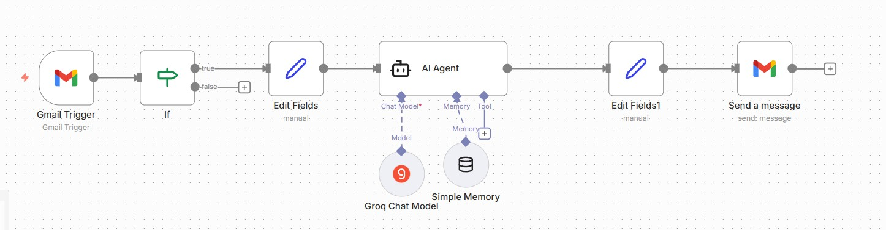
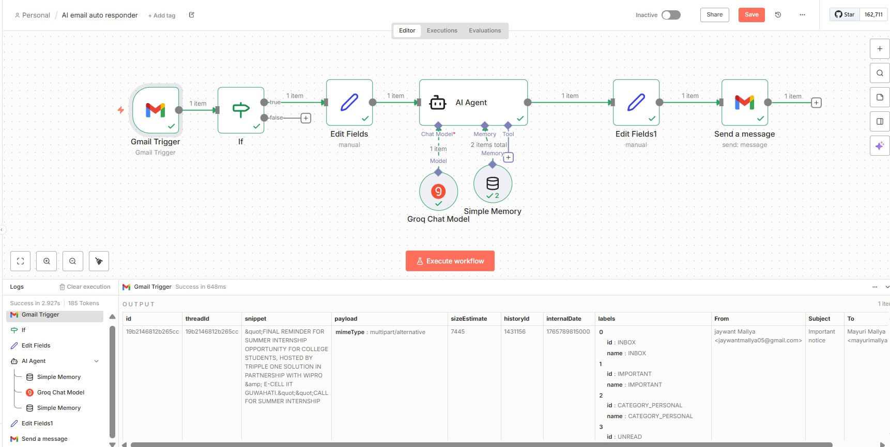

# ai-gmail-auto-responder-n8n
AI-powered Gmail auto-responder using n8n and LLMs
# AI Gmail Auto-Responder (n8n + LLM)

## Overview
This project is an AI-powered email automation built using n8n. 
It automatically reads incoming Gmail messages and sends short, professional replies using an LLM.

## Problem
Manually replying to repetitive emails is time-consuming and inefficient.

## Solution
The workflow listens for new emails, extracts sender and content information, generates a professional response using an AI model, and replies automatically while avoiding self-reply loops.

## Workflow Steps
1. Gmail Trigger detects new incoming emails
2. IF condition prevents replying to emails sent by the same account
3. Data cleaning and extraction of sender, subject, and body
4. AI Agent generates a professional reply
5. Gmail sends the auto-generated response

## Tech Stack
- n8n
- Gmail API
- Groq LLM
- JavaScript (data extraction & cleaning)

## Key Learnings
- Working with real Gmail trigger data
- Handling JSON field inconsistencies (From vs from)
- Preventing infinite auto-reply loops
- Separating AI reasoning from execution logic

## Current Status
Fully functional for testing and learning purposes.

## Future Improvements
- Reply only to important emails
- Add Google Sheets logging
- Email categorization using AI

- ## Screenshots

## Screenshots

### Workflow Overview

### AI Agent Configuration

### Successful Execution

